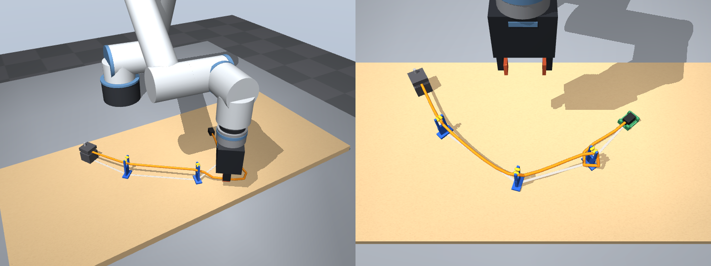
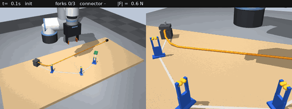
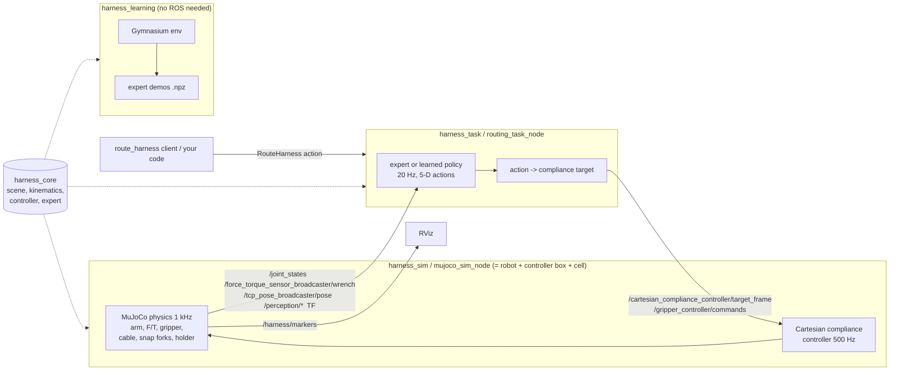

# Wire-harness routing robot (ROS 2 Jazzy + MuJoCo)

A simulated robot cell for **force-guided wire harness assembly**: a UR5e-class arm with a
wrist force/torque sensor and a parallel gripper routes a deformable wire through three
**snap-in forks** on a formboard and seats its **connector** in a holder. It comes with

* a physics simulation in MuJoCo (the wire is a Cosserat-rod cable, the forks have
  spring-loaded, barbed jaws, the connector has to find a pocket with 0.8 mm clearance and
  clicks into its latch when pressed fully down),
* a **UR-driver-like ROS 2 interface** (joint states, wrist wrench, compliance targets,
  joint trajectories, gripper action, TF, RViz markers),
* a **500 Hz Cartesian compliance (admittance) controller**, like UR force mode or FZI's
  `cartesian_compliance_controller`,
* a **scripted, force-guided expert** that solves the task on randomised layouts,
* a **Gymnasium environment** and a **demonstration recorder** for imitation / reinforcement
  learning, with bit-exact replay,
* a **build agent**: NVIDIA Nemotron on Nebius Token Factory reads a harness spec, decides
  every step, checks each result and recovers from failures, driving the robot's
  force-controlled skills as tools (section 5),
* a **physics benchmark suite** that measures the simulated wire against beam theory, with an
  Isaac Sim port for comparison (section 8).



The task is chosen because it is where model-based automation struggles and learning has
a real edge: the wire's shape is uncertain, snapping it into a fork is a force event, and the
connector insertion needs a search under contact.

---

## 1. Quick start (Windows + WSL2 + ROS 2 Jazzy)

Requirements: Windows 11 with WSL2 (WSLg gives you the RViz / MuJoCo windows), Ubuntu 24.04
in WSL, ROS 2 Jazzy installed from apt (`/opt/ros/jazzy`).

```bash
# in the Ubuntu (WSL) terminal
mkdir -p ~/harness_ws/src
cd ~/harness_ws/src
# copy the zip from Windows (adjust the user name), then unpack it
cp /mnt/c/Users/<you>/Downloads/wire_harness_robot.zip .
sudo apt install -y unzip
unzip wire_harness_robot.zip            # -> ~/harness_ws/src/wire_harness_robot

bash wire_harness_robot/scripts/setup_wsl.sh   # apt + pip dependencies (once)

cd ~/harness_ws
source /opt/ros/jazzy/setup.bash
colcon build --symlink-install
source install/setup.bash

ros2 launch harness_bringup demo.launch.py     # RViz + simulation + routing starts by itself
```

Useful variations:

```bash
ros2 launch harness_bringup demo.launch.py viewer:=true    # also open the MuJoCo viewer
ros2 launch harness_bringup demo.launch.py seed:=7         # another random layout

# run the cell and start jobs yourself
ros2 launch harness_bringup cell.launch.py
ros2 run harness_task route_harness                        # route + connector
ros2 run harness_task route_harness --reset 12             # rebuild the cell (seed 12) first
ros2 run harness_task route_harness --skip-connector

ros2 launch harness_description display.launch.py          # only the robot model, with sliders
```

Keep the workspace inside the Linux file system (`~/...`), not under `/mnt/c`: builds and
Python imports are much faster there.

If you keep the checkout on the Windows side (say on the Desktop, to edit it with Windows
tools), build it through a link instead of copying it:

```bash
bash "/mnt/c/Users/<you>/Desktop/<folder>/wire_harness_robot/scripts/wsl_link_workspace.sh"
source ~/harness_ws/install/setup.bash
```

`~/harness_ws` then holds only a symlink to the checkout plus the build output, and edits to
Python files take effect without rebuilding.

---

## 2. What the robot does

```
for each fork i (in route order)
  pick     grasp the wire where it will have to lie just past fork i:
           guarded touch-down of the finger pads on the board (F/T), back off 1.5 mm, close
           (finger orientation chosen so the held wire can be turned to run away from
           its fixation - otherwise it folds into a hairpin at the fingers)
  carry    sweep the wire around its last fixation point, taut and lifted, so it
           cannot drag across and snag on other fork posts
  lower    go down beyond the fork while regulating wire tension from the F/T sensor
           (take up slack by moving away, give way when the tension rises)
  seat     ramp the tension, centre the wire over the slot (perception feedback) and
           wiggle until it snaps past the barbed jaws; release
connector  pull it over by its wire if it stands on its end, move it if it lies next
           to a fixture, pick it, approach the pocket from behind so the wire runs out
           through the back slot, guarded descent, force-controlled spiral search,
           press, release, check
```

The expert only uses information a real cell could have: the F/T wrench, robot state,
fixture CAD poses, and *noisy* perception of the cable keypoints, connector pose and holder
pose. With randomised layouts (fork and holder positions ±12 mm and ±6°, wire stiffness
×0.6–1.3, friction ×0.8–1.25, wire slack, initial wire shape) it solved **64 of 64** test
episodes (seeds 0–15, 100–131 and 200–215: all three forks routed and the connector
latched), in 61–105 s of robot time (median 73 s).



---

## 3. Architecture



The same Python core (`harness_core`) drives the ROS nodes and the Gymnasium environment,
so the expert, the controller and the observation/action definitions are identical in both.

### Packages

| package | type | content |
|---|---|---|
| `harness_core` | Python | cell config, MJCF generator, UR5e DH kinematics, compliance controller, scripted expert, observation/action definitions (no ROS imports) |
| `harness_description` | CMake | URDF/xacro of the UR5e-class arm + F/T sensor + gripper (matches the MuJoCo model exactly, see tests), RViz config, `display.launch.py` |
| `harness_interfaces` | CMake | `CableState.msg`, `TaskStatus.msg`, `ResetCell.srv`, `RouteHarness.action` |
| `harness_sim` | Python | `mujoco_sim_node`: physics + UR-driver-like ROS interface |
| `harness_task` | Python | `routing_task_node` (RouteHarness action server, expert or learned policy), `route_harness` CLI |
| `harness_learning` | Python | `HarnessRouting-v0` Gymnasium env, `record_demos`, `replay_demo`, `inspect_demos`, `run_expert` |
| `harness_agent` | Python | build agent: harness specs and drawings, the robot's skills as tools, Nemotron planner on Nebius Token Factory, camera check with a vision model, recovery benchmark, `run_build`, `check_nebius`, `vision_eval`, `benchmark` |
| `harness_bench` | Python | cross-simulator benchmarks: runs the same rigs and the same analysis on MuJoCo or Isaac Sim and writes a comparison report |
| `harness_bringup` | Python | `cell.launch.py`, `demo.launch.py`, `config/cell.yaml` |

### ROS interface of the simulated cell

Names follow `ur_robot_driver` / ros2_control conventions where one exists, so task code can
later talk to a real UR5e with few changes.

| name | type | notes |
|---|---|---|
| `/joint_states` | `sensor_msgs/JointState` | 6 UR joints (same names and zero pose as `ur_description`) + 2 finger joints, 125 Hz |
| `/force_torque_sensor_broadcaster/wrench` | `geometry_msgs/WrenchStamped` | frame `ft_frame`, payload compensated, with noise |
| `/tcp_pose_broadcaster/pose` | `geometry_msgs/PoseStamped` | TCP (between the pads) in `world` |
| `/cartesian_compliance_controller/target_frame` | `geometry_msgs/PoseStamped` | TCP target → compliance mode |
| `/cartesian_compliance_controller/target_wrench` | `geometry_msgs/WrenchStamped` | wrench the tool should apply (world axes) |
| `/forward_velocity_controller/commands` | `std_msgs/Float64MultiArray` | joint velocities → velocity mode (0.2 s watchdog) |
| `/scaled_joint_trajectory_controller/follow_joint_trajectory` | `control_msgs/FollowJointTrajectory` | joint trajectories (e.g. from MoveIt) |
| `/gripper_controller/gripper_cmd` | `control_msgs/GripperCommand` | `position` = opening in m, `max_effort` in N |
| `/gripper_controller/commands` | `std_msgs/Float64MultiArray` | `[opening]`, streaming alternative |
| `/perception/cable` | `harness_interfaces/CableState` | noisy wire centreline (what a cable tracker would give) |
| `/perception/connector_pose`, `/perception/holder_pose` | `geometry_msgs/PoseStamped` | noisy |
| `/sim/task_status` | `harness_interfaces/TaskStatus` | ground truth (sim only) |
| `/harness/markers` | `visualization_msgs/MarkerArray` | board, forks (moving jaws), holder, wire, connector |
| TF | | `world → base_link → … → tool0 → ft_frame → tcp` (robot_state_publisher), `world → fork_i / holder / anchor` (sim) |
| `/route_harness` | `harness_interfaces/RouteHarness` action | run a routing job, feedback: phase, fork, tension, force |
| `/sim/reset` | `harness_interfaces/ResetCell` | new layout / wire (seed, randomize) |
| `/io_and_status_controller/zero_ftsensor` | `std_srvs/Trigger` | re-zero the F/T sensor |
| `/dashboard_client/unlock_protective_stop` | `std_srvs/Trigger` | the controller latches a protective stop above 120 N |

The last command source wins: publishing a compliance target, a joint velocity or sending a
trajectory switches the mode, like switching controllers on the real robot.

---

## 4. Learning

Everything learning-related runs without ROS (`source install/setup.bash` just puts the
packages on the Python path).

```python
import gymnasium as gym
import harness_learning                          # registers the envs

env = gym.make("HarnessRouting-v0")              # randomised layouts ("...Nominal-v0": fixed)
obs, info = env.reset(seed=3)
obs, reward, terminated, truncated, info = env.step(env.action_space.sample())
```

* **Action** (5, in [-1, 1], 20 Hz): TCP displacement `dx dy dz` (≤ 1 cm/step), yaw
  increment (≤ 0.15 rad/step) and gripper (−1 open … +1 close with 30 N). The tool stays
  vertical; the 500 Hz compliance controller underneath turns position leads into bounded
  contact forces (stiffness 3 kN/m, lead ≤ 2 cm), so a policy controls force through position,
  as with an impedance-controlled robot.
* **Observation** (99 floats; layout in `env.unwrapped.obs_layout`): TCP pose, gripper
  opening, **wrist wrench**, commanded lead, joint positions, 16 cable keypoints, connector
  pose, fork/holder/anchor poses, perceived progress flags, time.
* **Reward**: +1 per fork the wire snaps into (−1 if it leaves), +2 connector seated, +5
  success, small time and excessive-force penalties, −5 on a protective stop.

Record expert demonstrations (successful episodes only unless `--keep-failures`):

```bash
ros2 run harness_learning record_demos --episodes 100 --out ~/harness_demos --workers 4
ros2 run harness_learning inspect_demos ~/harness_demos
ros2 run harness_learning replay_demo ~/harness_demos/episode_000003.npz --video replay.mp4
ros2 run harness_learning run_expert --seed 3 --video expert.mp4      # watch the expert
```

Each episode is an `.npz` with `obs (T+1, 99)`, `actions (T, 5)`, `rewards`, `terminated`,
`truncated`, `success`, `seed` and metadata (config, expert log). Replaying the actions from
the stored seed reproduces the episode exactly, which makes the data set easy to audit and
to convert to robomimic / LeRobot format.

**Running a learned policy on ROS.** Any object with `act(obs_vector) -> action` (or a
plain function) can replace the expert in the task node:

```bash
ros2 launch harness_bringup cell.launch.py policy:=my_pkg.my_module:MyPolicy
```

The node builds the observation vector from ROS topics with the same function the env
uses (`harness_core.observation.flatten_obs`), so a policy trained in the env runs unchanged.

---

## 5. Build agent: Nemotron on Nebius Token Factory

A harness spec goes in, a checked build comes out. The work is split where it belongs:

* **Skills** (the force-guided expert) do everything where physics matters: guarded
  touch-down, the taut carry over a fork, the snap past the barbs, the spiral search for the
  pocket. A language model at a few calls per second cannot close a force loop.
* **The agent** (Nemotron) does what a script does badly: it reads the job, runs one skill
  at a time, checks what perception reports after each one, goes back when an earlier fork
  has lost the wire, picks a recovery when a skill fails, and writes an honest report.

The agent only ever sees perception (noisy cable keypoints, connector pose, wrist wrench), the
same information a real cell has. Simulator ground truth is logged next to it for scoring and
never shown to the model.

```bash
# once: a Token Factory key (tokenfactory.nebius.com), then check the setup
export NEBIUS_API_KEY=...
ros2 run harness_agent check_nebius               # lists the models, tests a tool call and an image
ros2 run harness_agent check_nebius --vision-all  # which of your models accept images

SPECS=$(ros2 pkg prefix harness_agent)/share/harness_agent/specs
ros2 run harness_agent run_build --spec $SPECS/demo_3fork.yaml --planner nemotron --vision --video
ros2 run harness_agent run_build --spec $SPECS/demo_3fork.yaml --planner scripted   # no model
ros2 run harness_agent run_build --spec $SPECS/demo_infeasible.yaml --planner nemotron
```

Each run writes `drawing.png` (the formboard drawing generated from the spec), `report.md`
(every step with its outcome), `trace.json` (tool calls, model messages, token usage, ground
truth), with `--vision` the inspection photos in `inspection/`, and with `--video` both
`video.mp4` and `video_annotated.mp4` to `runs/<spec>_<planner>_<seed>/`. The annotated video
puts the cell next to the planner: the step that is running, the steps so far with their
outcomes, the model's reasoning for the current step, disturbances as they happen, and at the end
the inspection photos with the camera's verdicts and whether the planner's verdict matches the
simulator (`python -m harness_agent.annotate <run folder>` redoes it for an existing run).

**No success without evidence.** `finish(success=true)` is refused unless an `inspect` of
everything, made after the last physical skill and with the arm retreated out of the camera's
view, shows every fixture seated. The first live run showed why: Nemotron wrote "retreat, then
inspect all, then finish" in its reasoning and then went straight to `finish`. The verdict
happened to be right; now it has to be earned.

**Camera check (`--vision`).** `inspect` also photographs each fixture from two angles with a
virtual inspection camera and asks a vision-language model on Token Factory about it. Perception
stays the primary check; when the two disagree the agent looks again from new angles and flags the
fixture for a manual check if they still disagree. None of the NVIDIA models on Token Factory take
images today, so the vision model is one of the open VLMs there (`check_nebius --vision-all` found
MiniCPM-V 4.5, Gemma 3 27B and Kimi K3); Nemotron stays the planner.

How far to trust the camera check is measured, not assumed. `vision_eval` builds harnesses in
simulation, photographs the fixtures along the way, including deliberately botched steps (wire
released over the fork, wire resting on the lips instead of pressed in, connector dropped on its
holder), labels every image with simulator ground truth, and scores any number of models and
question styles on the same images, with perception as the baseline:

```bash
ros2 run harness_agent vision_eval make-set --out vision_set2 --seeds 0-11    # simulation only
ros2 run harness_agent vision_eval score --set vision_set2 \
    --model openbmb/MiniCPM-V-4_5 --model google/gemma-3-27b-it --style v1 --style v2 --style v2refs
```

`score` writes `report.md`: accuracy, defect recall (not-seated fixtures caught), false alarms
(good fixtures rejected), results on the hard cases and per fault, latency, tokens per image, and a
sheet of the images each model got wrong.

The first round (style v1: two general views, "is the wire seated in this fork?") was sobering:
the small models repeated the definition of "seated" back as their evidence, and the views were
ambiguous (a wire lying on the board behind a fork looks as if it runs through the slot). Style v2
is the fix: both views look straight *through* the slot from opposite sides (a seated wire shows
as orange inside the gap; otherwise the gap is empty), the fixture to check is boxed in magenta,
and the model answers one local question per view ("is there orange wire in the gap between the
prongs?"). The code, not the model, combines them: seated only if both views say yes. `v2refs`
adds two labelled example images from a build outside the set. Style v3 then looked 25 degrees
off the slot axis and spelled out that a wire running through the gap is also seen in front of
and behind the fork (Kimi's unanswered images were all seated wires pointing straight at the
camera, which the v2 wording called "in front of the fork"). On 134 labelled images (60 not
seated, 15 of them hard cases such as a wire resting on the lips):

| check | accuracy | defects caught | false alarms | hard defects caught | median latency |
|---|---|---|---|---|---|
| perception (cable keypoints) | 99% | 98% | 0% | 93% | - |
| Gemma 3 27B, v1 | 60% | 12% | 0% | 13% | 3.0 s |
| MiniCPM-V 4.5, v1 | 74% | 50% | 7% | 7% | 0.7 s |
| MiniCPM-V 4.5, v2 | 79% | 63% | 8% | 40% | 0.8 s |
| MiniCPM-V 4.5, v3 | 75% | 45% | 1% | 40% | 0.8 s |
| Gemma 3 27B, v2refs | 77% | 57% | 7% | 33% | 2.1 s |
| Kimi K3, v2refs | 69% (92 of the 94 it answers) | 92% | 3% | 93% | 12.6 s |
| Kimi K3, v3refs | 85% (all 114 it answers) | 88% | 0% | 80% | 16.0 s |
| Kimi K3 v2refs, MiniCPM-V v2 when Kimi has no answer | 96% | 97% | 5% | 100% | |
| **Kimi K3 v3refs, MiniCPM-V v3 when Kimi has no answer** | **96%** | **93%** | **1%** | **87%** | |

Kimi K3 is a reasoning model: with v3 and the examples it answered 114 of the 134 images and was
right on every one; on the other 20 it spends its 4,000-token budget thinking, and MiniCPM-V
answers in under a second. The small models did not gain from v3 (they called more fixtures
seated), and the examples made MiniCPM-V worse, so it runs without them. The last pair is the
default camera check (`default_inspector`; the examples ship in `refs/`): 5 errors in 134, all
from the fallback, 1% false alarms. It also catches the one defect perception missed, a connector
sitting tilted in its pocket ("one end higher than the other, resting on a rail").

**Recovery benchmark.** Things go wrong on a real line between two robot moves, and a
supervisor earns its keep by noticing. `benchmark` runs planners through the same builds with
the same disturbances injected at the same points (`disturbances.py`):

* `popped_wire`: right after F2 is routed, a snag opens its jaws and pulls the wire out
  sideways (servoed forces, so only the wire at F2 moves). The planner only finds out from the
  next state it is shown, or when the next `route_fork` is refused.
* `slip_on_insert`: the first insertion loses the connector above its holder; it usually lands
  on a rail or wall, where the fingers cannot get around it.
* `both`, and `nominal` for reference.

```bash
ros2 run harness_agent benchmark --planners scripted --seeds 0-4 --out runs/bench
ros2 run harness_agent benchmark --planners nemotron --seeds 0-4 --out runs/bench   # same table
```

The table counts builds that succeeded (ground truth), honest verdicts (the final claim matched
the truth), steps, robot time and model tokens per build. Runs already in `--out` are skipped, so
planners can be added at different times and on different machines.

First round, five randomised layouts per scenario:

| planner | nominal | popped wire | connector slip | both | honest verdicts | tokens per build |
|---|---|---|---|---|---|---|
| scripted rules | 5/5 | 5/5 | 5/5 | 4/5 | 20/20 | - |
| Nemotron 3 Super | 5/5 | 5/5 | 5/5 | 3/5 | 20/20 | 32k-63k |

Nemotron recovered every popped wire from the refused `route_fork` alone ("F2 lost the wire,
route it again"), inspected before every `finish` (the evidence gate never had to step in), and
never claimed a build it had not finished. Every failure, for both planners, was the same: the
connector slipped onto the holder rails and the fingers could not get around it; after four
inserts both stopped, as their rules say. Nemotron's reasoning considered relocating it first,
but stuck to the stop rule. That recovery was in neither the prompt nor the script, so one line
now says it (grasp trouble on insert: relocate, then insert again), in both.

**Harness specs** are YAML in board millimetres, as on a drawing:

```yaml
harness: {name: Door module sub-harness DM-07, revision: B}
board: {size_mm: [1000, 440]}
clamp: {id: CL1, at_mm: [260, 80]}
forks:
  - {id: F1, at_mm: [340, 220]}
  - {id: F2, at_mm: [480, 320]}
  - {id: F3, at_mm: [630, 280]}
connectors:
  - {id: X1, holder_at_mm: [720, 180], part_number: X1-2P-28}
wires:
  - {id: W1, from: CL1, route: [F1, F2, F3], to: X1, diameter_mm: 6.0,
     stiffness: nominal, slack_mm: 75}
```

`validate()` checks a spec against what the cell can do (reach, fixture spacing, turn angle
at each fork, slack, crossings) and says why in plain words, so the agent can refuse an
unbuildable job instead of damaging it. Current state of the example specs:

| spec | result |
|---|---|
| `demo_3fork` | builds (the cell's nominal layout) |
| `demo_2fork_stiff` | builds, stiffer bundle |
| `demo_4fork` | **known hard case**: after F2 the free wire lies against F3 and the carry snags on it; the scripted planner and the original expert both fail today |
| `demo_infeasible` | refused with five reasons (slack, off-board holder, reach, spacing, sharp turn) |

The Token Factory client uses only the Python standard library, retries rate limits, server
errors and timeouts, and picks the planner and vision models from the models your key can see
(`HARNESS_PLANNER_MODEL` / `HARNESS_VISION_MODEL` override the choice).

---

## 6. Configuration and randomisation

`harness_bringup/config/cell.yaml` holds every parameter of the cell (geometry of wire,
forks, connector and holder, the formboard layout, robot and gripper, controller gains,
sensor/perception noise, randomisation ranges). Pass your own file with
`config:=/path/cell.yaml` (launch) or `--config` (learning tools). Things worth playing with:

* `fork.spring_stiffness`, `fork.spring_preload`, `fork.lip_gap`: how hard the snap is
* `holder.clearance`, `holder.latch`: pocket fit, and whether a fully inserted connector
  clicks in (a weld constraint that engages at the pose where it was pressed home; without
  it, a stiff wire can lever a light connector back out of the pocket)
* `wire.bend_modulus`, `wire.radius`, `wire.slack`: a stiffer / thinner / tighter wire
* `layout.fork_xy`, `layout.holder_xy`: a different formboard (any number of forks)
* `noise.*`: F/T noise and bias, perception noise on cable and holder pose
* `controller.*`: compliance gains (keep `kp/kf` stiffness and contact stability in mind)

---

## 7. Tests

```bash
cd ~/harness_ws
colcon test --packages-select harness_core harness_learning harness_agent && colcon test-result --verbose
HARNESS_SLOW_TESTS=1 python3 -m pytest src/wire_harness_robot/harness_core/test   # + a full episode
```

The agent tests need no key and no network: the Token Factory client runs against a local
fake server (retries, timeouts, malformed answers), the planner loop against a scripted
stand-in for the model, and the camera check against a stub vision model.

The tests check, among others, that the DH kinematics, the URDF used by RViz and the MuJoCo
model agree to 1e-6, that the F/T sensor is payload compensated, that force control settles
on a stiff surface, and that environment rollouts replay bit-exactly.

---

## 8. Physics benchmarks, and the Isaac Sim comparison

A success rate is only worth as much as the physics behind it, so the cell comes with a
benchmark suite that measures the wire and the fork against **analytic references** rather
than against another simulator's opinion: the continuum elastica for a drooping wire, the
catenary for a hanging one, the limp-chain and clamped-beam limits for its swing, and the
nominal friction coefficient for sliding. The same rigs run on a second engine, so the
report says what changes when the physics engine changes.

```bash
# MuJoCo (no GPU needed)
ros2 run harness_bench run_benchmarks --engine mujoco --out results/mujoco.json
# Isaac Sim, in its own Python 3.11 environment (see isaac/README.md)
python run_isaac_benchmarks.py --out results/isaac.json
# one report from both
ros2 run harness_bench compare_benchmarks results/mujoco.json results/isaac.json --out report
```

Measured: droop of a clamped wire (against the elastica, swept over free length *and*
segment length), sag between two supports (against the catenary), swing frequency and
damping, the force to snap a wire past the fork's barbed jaws and to pull it out again,
the effective friction on the board, wall-clock cost against cable resolution, and the
largest timestep at which the answer still holds.

The MuJoCo reference run is in [`docs/benchmarks/report.md`](docs/benchmarks/report.md).
Two results are worth repeating here:

* In the floppy regime the cable is **accurate**: sag within 1–3 % of the catenary,
  effective friction 0.53 against a nominal 0.50.
* Where bending matters it is **too stiff, and the cause is the segment length**. A 90 mm
  free end droops 18.6 mm with the cell's 30 mm segments, 28.0 mm at 15 mm, 33.0 mm at
  7.5 mm, against 38.0 mm for the continuum rod. So the 30 mm discretisation buys its
  speed by making the wire stiffer than it should be, most of all when the free length is
  near the wire's gravity/bending length (57 mm for this bundle). Halving the segment
  length costs roughly 4x in simulation time, which is the trade to make deliberately.

The Isaac Sim side lives in [`isaac/`](isaac/README.md) and models the wire the way PhysX
can: a capsule chain whose joint drives carry the same bending stiffness
(`k = EI / L_segment`). It needs an RTX GPU and its own Python environment, so it is kept
out of the colcon workspace.

---

## 9. Toward the real cell

* **Robot**: joint names, zero pose, `base_link`/`base`/`tool0` match `ur_description`, and the
  topics mirror `ur_robot_driver`. For force control on hardware use UR force mode
  (`force_mode_controller`) or FZI `cartesian_compliance_controller` with the same
  target/wrench topics; the expert only needs a compliance target interface.
* **Perception**: the expert consumes cable keypoints, connector and holder poses. On a real
  cell these come from a camera-based cable tracker and fiducials/CAD registration of the
  formboard; the simulated perception adds noise so the controller is not tuned to ground truth.
* **Gripper**: model your gripper's stroke, speed and force in `robot.*`; finger pads that
  can reach 1.5 mm above the board are what make the touch-down grasp of a wire work.
* **Formboard**: fork positions come from TF (`fork_i`), i.e. from your board's CAD.

---

## 10. Troubleshooting

* **No windows in WSL**: WSLg needs Windows 11 (or Windows 10 22H2+ with the WSL store app).
  Check `echo $DISPLAY`. Headless use: `rviz:=false`, videos render with OSMesa.
* **MuJoCo viewer fails** (`viewer:=true`): try `export MUJOCO_GL=glfw`; the simulation keeps
  running without the viewer if it cannot open a window.
* **`numpy` import errors after pip**: ROS 2 Jazzy uses the system numpy 1.26; the setup script
  pins `numpy<2`. If a newer numpy slipped into `~/.local`, run
  `python3 -m pip uninstall numpy` (the user-site copy) and keep the system one.
* **Slower than real time**: the simulation runs as fast as it can when it cannot keep up;
  lower the load with `rviz:=false` or reduce `real_time_factor`. Learning tools do not
  depend on wall-clock time.
* **Nodes do not see each other**: in WSL keep everything in one distro; if you use several
  terminals, source `install/setup.bash` in each.
* **`colcon test` fails with `PluginValidationError ... launch_testing`**: a pip-installed
  pytest 9 is too new for the ROS 2 Jazzy pytest plugins. Remove it
  (`python3 -m pip uninstall pytest`, keeping the apt `python3-pytest`) or run the tests with
  `PYTEST_DISABLE_PLUGIN_AUTOLOAD=1 colcon test ...`.

## 11. Limitations / next steps

* The expert is a script. It solves the randomised layouts above, but it has no answer for
  situations it was not written for (a wire caught under a fixture, layouts outside the
  randomisation ranges, a different wire or fork design); `record_demos` drops failed
  episodes. Those are exactly the cases where a learned, force-reactive policy should beat it.
* The cable is stiffer than a continuum rod at the cell's 30 mm discretisation (section 7),
  so contact forces during seating are on the high side. The benchmark suite is there to
  keep that honest, and the segment length is one line of config.
* The arm links are visual only in the physics (the gripper and F/T sensor collide).
* A connector can end up in the pocket but not clicked in: the holder latch needs it within
  0.8 mm of the floor and 3 degrees level, the seat check accepts 2 mm. It holds in the
  normal builds, but after a botched drop onto the holder rails one run was later pulled
  out by the wire. Planned fix: a pull test after insertion, as on a real line.
* After a slip, the connector can sit on the holder where the fingers cannot reach around it;
  `insert_connector` then fails with `grasp_blocked_by_fixture`, and the way out is
  `relocate_connector` first. The scripted planner does not know that rule (it is not in the
  prompt either); whether a planner works it out is part of what the benchmark measures.
* Nothing here has been measured against a real harness bundle yet. The two measurements
  that would anchor everything else: bending stiffness of a real bundle (clamp a length
  horizontally, measure the droop, invert the elastica) and its friction on the board.
* Next: behaviour cloning / diffusion policy on the demos, image observations (wrist camera
  `wrist` is already in the model), branches (Y-splits) and multiple wires, a real UR5e.
