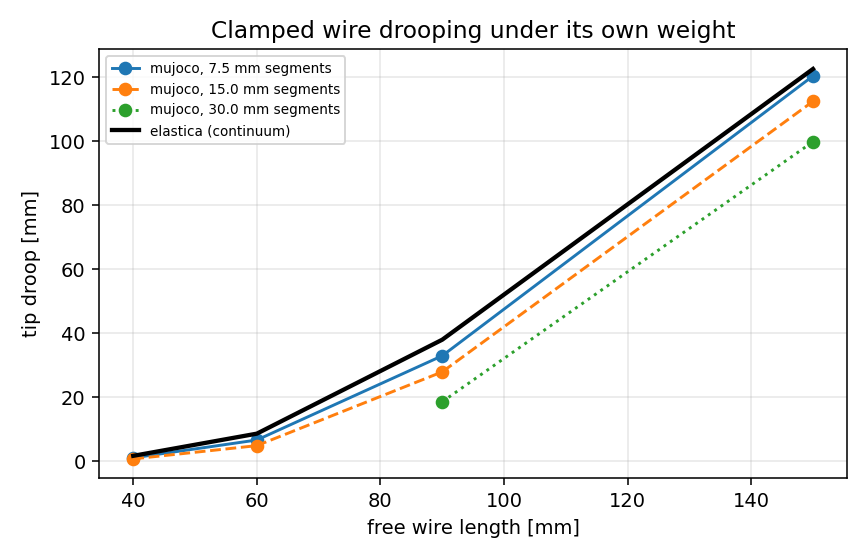
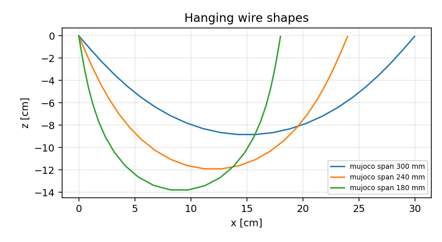
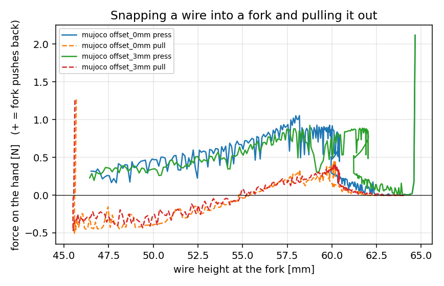
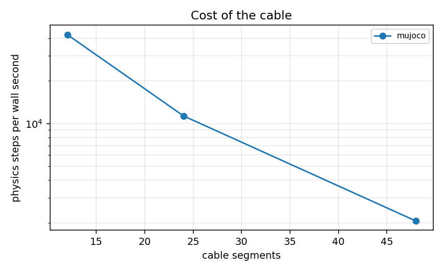

# Wire-harness cell: physics benchmarks

* **mujoco** 3.13.0 - mujoco.elasticity.cable (Cosserat rod plugin) (Linux-6.18.44-fc-v37-x86_64-with-glibc2.39)

All numbers are computed by the same analysis code from traces the engines
produce; the reference column is analytic (elastica, catenary, limp chain,
nominal friction coefficient), so each engine can be read against theory.

| quantity | mujoco | reference | unit |
|---|---|---|---|
| Cantilever droop (cell segmentation) | 99.9 | 123 | mm |
|   ... error vs elastica | -18.5 | - | % |
| Sag at the widest span | 88.7 | 88.0 | mm |
|   ... error vs catenary | -1.123 | - | % |
| Release-from-horizontal frequency | 2.114 | 1.413 | Hz |
| Damping ratio | 0.041 | - | - |
| Force to snap the wire into a fork | 1.072 | - | N |
| Force to pull it back out | 0.425 | - | N |
| Seated height above the slot bottom | 12.7 | - | mm |
| Effective friction on the board | 0.528 | 0.5 | - |
| Full cell speed | 1.43 | - | x real time |
| 48-segment cable | 2,059 | - | steps/s |
| Largest usable timestep | 64.0 | - | ms |

